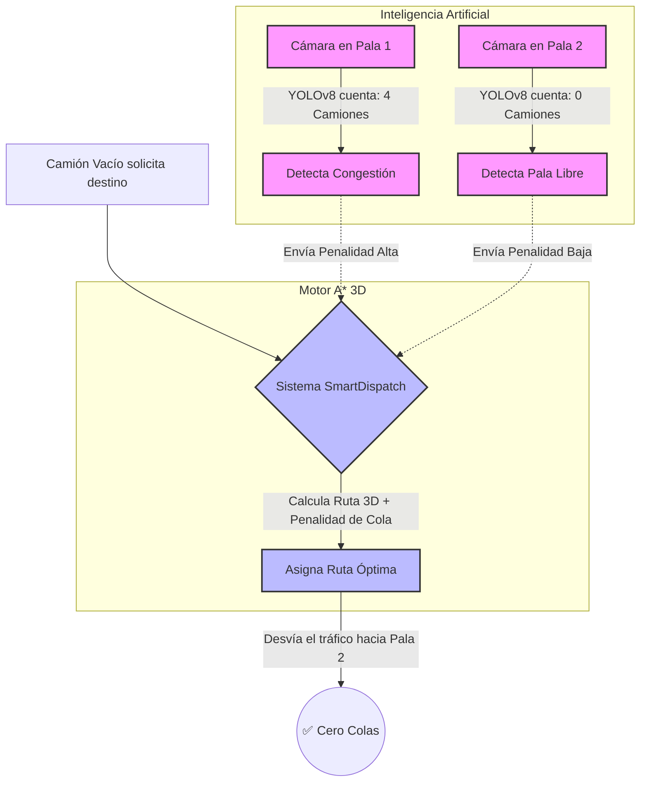

# 🚜 SmartDispatch A* + AI 
**Sistema de Enrutamiento Inteligente para Minería a Tajo Abierto - PERUMEC-athon**


## 📌 El Problema: Cuellos de Botella en la Mina
En la minería a tajo abierto, el sistema de Dispatch tradicional asigna camiones a la pala más cercana (distancia plana). Esto genera un problema crítico: **Cuellos de Botella**. Múltiples camiones se dirigen a la misma pala, formando colas interminables, desperdiciando combustible y tiempo, mientras otras palas pueden estar vacías.

## 💡 Nuestra Solución: Vision-Based Dynamic Dispatch
Llevamos el algoritmo A* al siguiente nivel industrial combinándolo con Inteligencia Artificial.

### ¿Cómo funciona? (Esquema Visual)



1. **El Cerebro (A* 3D):** En lugar de un mapa plano 2D, generamos una topografía 3D matemática del tajo abierto. El algoritmo calcula la ruta más corta considerando el gasto de combustible real según la pendiente y la carga del camión (300 Tn).
2. **Los Ojos (Visión Computacional):** Integramos **YOLOv8** simulando cámaras en las palas. La IA cuenta en tiempo real los camiones en la cola.
3. **El Despacho Dinámico:** El algoritmo suma el costo del viaje físico + la penalidad por espera en la cola. Si la Pala 1 está cerca pero saturada, el sistema re-enruta inteligentemente el camión hacia la Pala 2 que está vacía. **¡Cero colas!**

---

## 🚀 Cómo ejecutar el proyecto (Paso a Paso)

Sigue estos pasos para levantar el Gemelo Digital y la aplicación web en tu máquina local.

### 1. Instalar dependencias
Abre tu terminal en esta carpeta e instala las librerías necesarias con:
```bash
pip install -r requirements.txt
```

*(Librerías principales: `streamlit`, `numpy`, `plotly`, `ultralytics`, `opencv-python-headless`)*

### 2. Correr la aplicación
Levanta el dashboard interactivo ejecutando este comando en tu terminal:
```bash
streamlit run app.py
```
Esto abrirá automáticamente una pestaña en tu navegador web con el simulador 3D y las cámaras IA.

---

## 🛠 Arquitectura del Proyecto
El proyecto está diseñado de forma modular para una simulación rápida:
- `app.py`: Interfaz visual en Streamlit (El Simulador).
- `requirements.txt`: Dependencias del sistema.
- *(Próximamente)* Algoritmos de Terreno Sintético y Visión Computacional.
